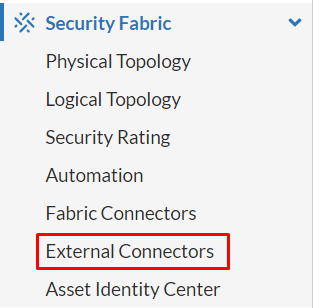
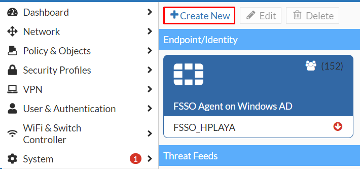
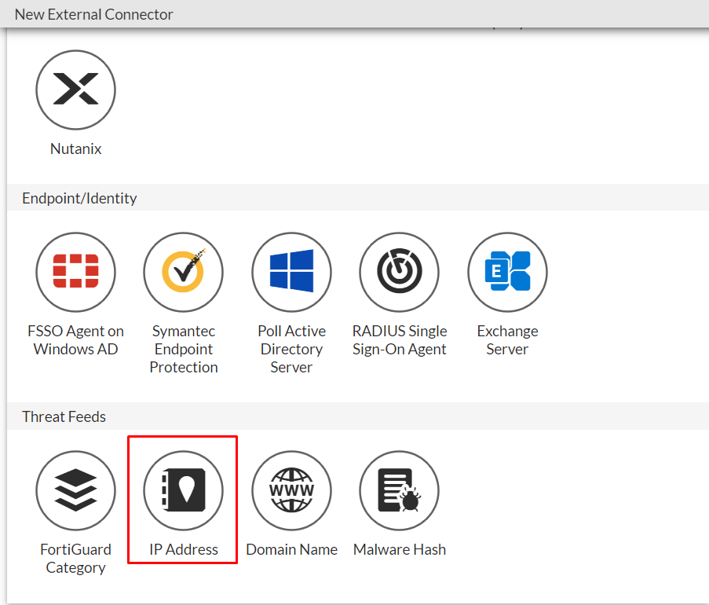
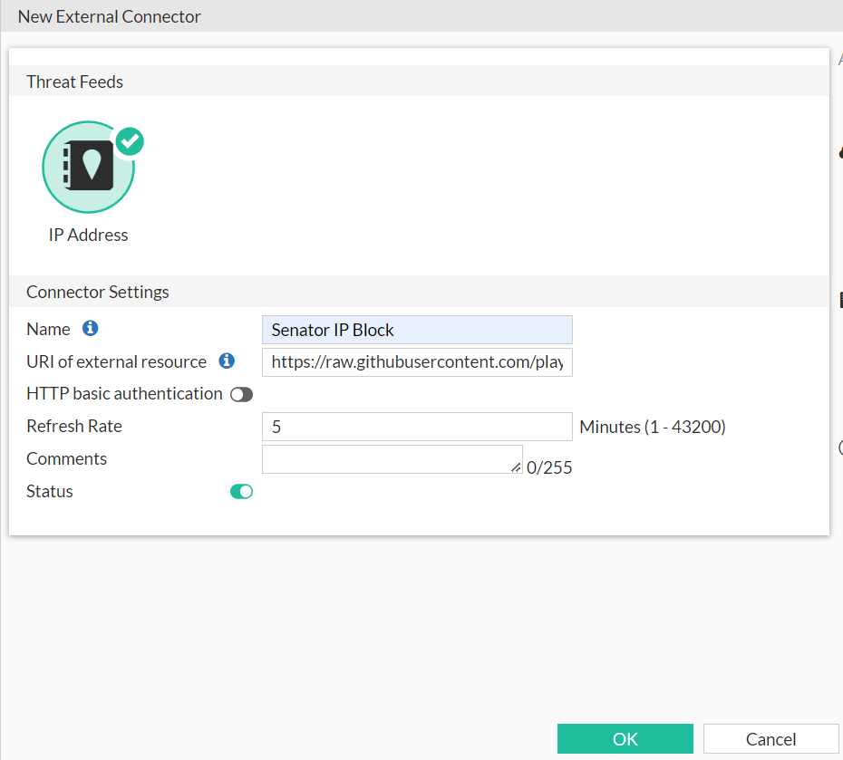
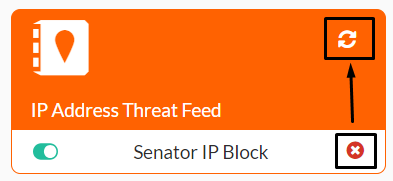
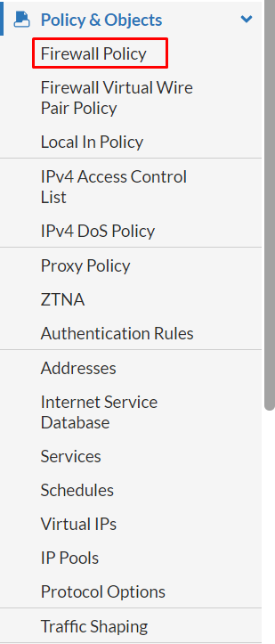
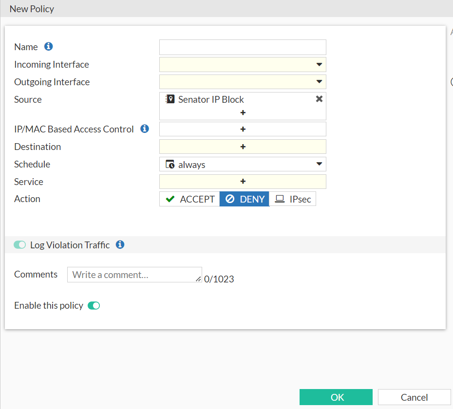

# Proyecto de bloqueo de direcciones IP de ciberdelincuentes para FortiGate

Desde **Senator Hotels & Resorts** sabemos que la ciberseguridad es importante, por ese motivo hemos decidido empezar este proyecto para tratar de evitar ciberataques mediante el bloqueo de direcciones IP en **[FortiGate](https://www.fortinet.com/products/next-generation-firewall)**. Mediante un fichero de texto con direcciones IP y una regla se pueden realizar bloqueos de las direcciones IP contenidas. ***Todas las direcciones IP contenidas en el fichero se verifican antes de su inserción en el fichero***.

## Índice

[Funcionalidades](#funcionalidades)

[Requisitos](#requisitos)

[Contribuciones](#contribuciones)

[Uso de los recursos del repositorio](#uso-de-los-recursos-del-repositorio)

[Uso del fichero de direcciones](#uso-del-fichero-de-direcciones)

[Uso del script de Python](#uso-del-script-de-python)

[Licencia](#licencia)

## Funcionalidades

+ **Fichero de direcciones IP para bloquear**: Listado de direcciones IP asociadas a actividades de ciberdelincuentes, el fichero puede importarse sin necesidad de descargarlo en los firewall FortiGate para bloquear automáticamente el tráfico de estas direcciones.

+ **Script de actualización y mantenimiento**: El script está en el lenguaje de programación **[Python](https://www.python.org/about/)**, añade y ordena de forma eficaz y rápida las direcciones IP que se van añadiendo mediante el mismo.

## Requisitos

Para hacer uso de los recursos de este repositorio es necesario:

+ **Sistema FortiGate** compatible con **External Connectors** desde su panel de administración.

+ Opcionalmente para añadir direcciones IP al fichero:
  + **Instalación de [Python3](https://www.python.org/downloads/)** en un sistema operativo compatible, por defecto está instalado en sistemas Linux, para añadir las direcciones IP al fichero de texto, no requiere la instalación del gestor de paquetes de Python, **PIP** ni tampoco la instalación de bibliotecas ya que hace uso de los recursos que vienen con el lenguaje de programación.

  + **Instalación de [Git](https://git-scm.com/downloads)** en un sistema operativo compatible, por defecto está instalado en sistemas Linux.

  + **Instalación de [Visual Studio Code](https://code.visualstudio.com/Download)** junto con la extensión **Python de Microsoft**.

## Contribuciones

Hay dos vertientes para poder contribuir con el proyecto, para ambas es necesario tener cuenta en GitHub:

1. Mediante **Issue** en GitHub verificaremos las direcciones IP que nos escribáis y las añadiremos al fichero de direcciones.

2. Mediante **Pull Request**:

    + Clonación del repositorio en local mediante `git clone` o `git pull` (si se ha clonado y para recibir las actualizaciones) y situarse en la ruta de clonación del repositorio.

    + Configuración de nombre de usuario y correo electrónico mediante:

      + `git config --global user.name "Nombre del usuario de GitHub"`.

      + `git config --global user.email "correo del usuario de GitHub"`.

    + Uso del script de Python, **add-ip-address-to-file.py**, para añadir direcciones IP al fichero de direcciones, ***principalmente para mantener un orden y evitar duplicados***.

    + Uso de `git add ip-address-of-attackers.txt` para añadir el fichero a la zona "staged".

    + Uso de `git commit -m "mensaje conciso" -m "descripción detallada opcional"` para añadir un comentario a la actualización del fichero.

    + Uso de `git push` para subir la actualización a GitHub.

## Uso de los recursos del repositorio

Trataremos de detallar el uso de cada recurso (script y fichero de direcciones) para que su uso sea lo más simple posible.

### Uso del fichero de direcciones

Desde el ***panel de administración de FortiGate***, buscaremos **Security Fabric** y a continuación, accederemos a **External Connectors**.

Pulsaremos en el botón **Create New** para proceder a importar el fichero de direcciones IP.

Buscaremos **IP Address** y pulsaremos en dicha opción.

Para el **External Connector**, pondremos un nombre y usaremos la URI del fichero en **formato raw** del repositorio de GitHub, en Refresh Rate pondremos cada cuánto tiempo queremos que se actualice la lista, a gusto personal, y guardaremos los cambios mediante el botón **OK**, en el caso de no saber obtener la URI, es la siguiente:

`https://raw.githubusercontent.com/playa-senator/ip-block-forti/main/ip-address-of-attackers.txt`

Tras crear el nuevo External Connector saldrá que está sin actualización, podemos dejar que se actualice automáticamente (según el tiempo asignado a Refresh Rate) o actualizarlo manualmente.

El siguiente paso es crear una regla en **Firewall Policy** y asignar la lista de direcciones IP según cada caso.

Configuraremos la nueva política según los parámetros necesarios y en **Source** pondremos nuestra lista de direcciones IP que hemos creado mediante External Connectors y guardaremos la nueva política.

### Uso del script de Python

El script de Python se puede ejecutar mediante **[IDLE](https://realpython.com/python-idle/)** de la instalación de Python o mediante [Visual Studio Code](https://code.visualstudio.com/docs/python/python-tutorial#_run-hello-world)

El script está preparado para pedir direcciones IP, comprobar si lo que se ha introducido es una dirección IP válida, en el caso de que sea una IP válida, comprueba el fichero para ver si está introducida o no, en el caso de que no exista en el fichero, la introduce y pide otra dirección IP, salvo que se pulse la tecla "**q**" que detendrá la ejecución del script.

## Licencia

Este proyecto se distribuye bajo la licencia **Apache 2.0**. Por favor, consulta el fichero **LICENSE** para más información.
